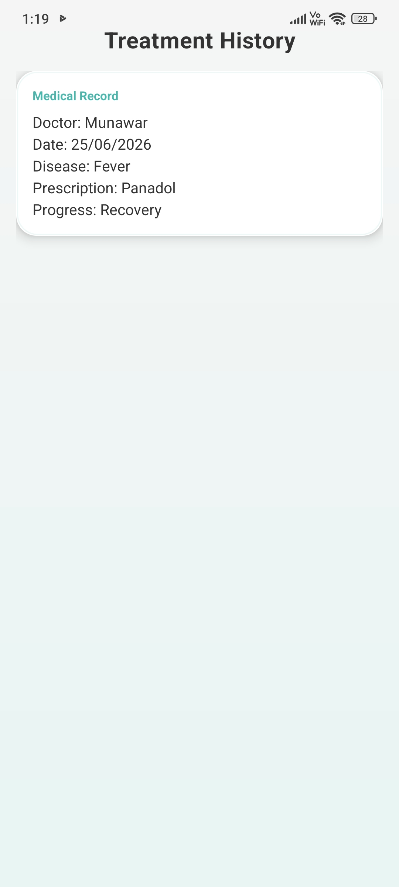
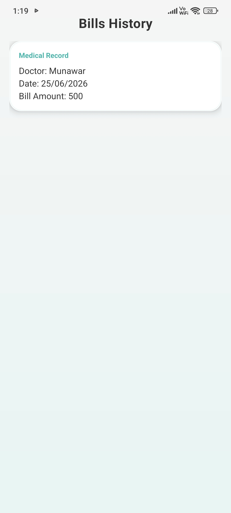
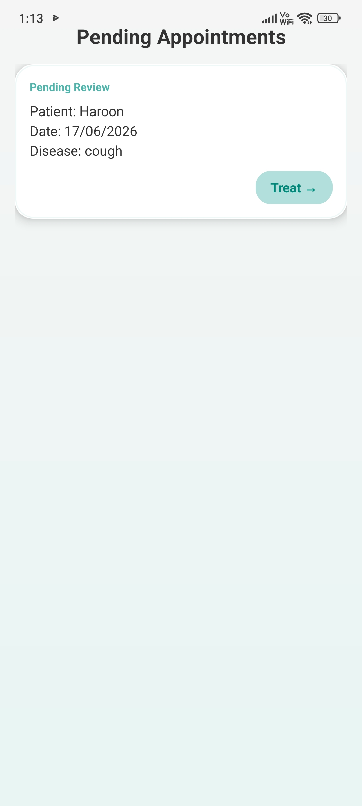
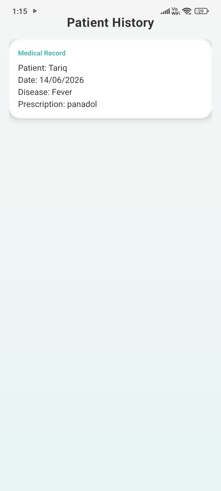

<div align="center">

# 🏥 MedSync - Medical Management System


**A dual-role healthcare platform connecting patients and doctors through secure, real-time mobile workflows.**

</div>

---

## 📖 Overview

**MedSync** is a native Android healthcare management application built around a **dual-role architecture** — giving **Patients** and **Doctors** tailored portals within a single app. Patients can register, book appointments, and review their treatment and billing history; doctors can manage schedules, update clinical records, and generate medical bills — all synchronized in real time via **Firebase**.

Developed and submitted as an academic project for **Mobile App Development** at the **University of Agriculture, Faisalabad**, MedSync demonstrates production-grade patterns including role-based authentication, cloud-backed data persistence, and Material Design UI.

---

## ✨ Features

### 👤 Patient Portal

| Feature | Description |
|---------|-------------|
| 🔐 **Secure Registration & Login** | Email/password sign-up and sign-in powered by Firebase Authentication |
| 👤 **Profile Management** | View personal details — name, email, and age — from a dedicated dashboard |
| 📅 **Appointment Booking** | Schedule visits with doctor name, **date/time picker**, and problem description |
| 🧾 **Bills History** | Review medical bills generated from completed appointments |
| 💊 **Treatment History** | Access diagnosis, prescription, and progress records in one place |

### 🩺 Doctor Portal

| Feature | Description |
|---------|-------------|
| 🏠 **Doctor Dashboard** | Central hub displaying profile, specialization, and quick navigation |
| ⏳ **Manage Pending Appointments** | Review incoming patient booking requests in real time |
| ✅ **Accept / Reject Appointments** | Approve or decline today's scheduled visits with one tap |
| 📝 **Diagnosis, Prescription & Progress** | Record clinical findings and treatment updates per appointment |
| 💰 **Generate Medical Bills** | Create itemized bills covering consultation and medicine fees |
| 📚 **Patient Medical History** | Browse completed treatment records across all patients |

### 🔐 Security Features

| Feature | Description |
|---------|-------------|
| 🔑 **Firebase Authentication** | Industry-standard email/password auth with secure session management |
| 🎭 **Role-Based Routing** | Post-login navigation driven by user role (`patient` or `doctor`) |
| 🛡️ **Secure Realtime Database Rules** | Read/write access restricted to authenticated users with role-aware policies |

---

## 👥 User Roles

| Role | Access | Key Features |
|------|--------|--------------|
| 👤 **Patient** | Patient Home, Booking, History screens | Register & login · View profile · Book appointments · Treatment history · Bills history |
| 🩺 **Doctor** | Doctor Dashboard, Appointment management, Clinical tools | Register & login · Pending appointments · Accept/reject visits · Update treatment · Generate bills · Patient history |

---

## 📸 Visual Showcase

### 👤 Patient Flow

| Role Selection | Patient Registration | Patient Dashboard |
|:---:|:---:|:---:|
|  |  |  |

| Treatment History | Bills History | |
|:---:|:---:|:---:|
|  |  | |

### 🩺 Doctor Flow

| Doctor Registration | Doctor Dashboard | Pending Appointments |
|:---:|:---:|:---:|
|  |  |  |

| Appointment Action | Today's Appointments | Treatment & Billing Entry |
|:---:|:---:|:---:|
|  |  |  |

| Patient History | | |
|:---:|:---:|:---:|
|  | | |

---

## 🛠️ Technology Stack

| Layer | Technologies |
|-------|-------------|
| 🎨 **Frontend** | XML · Material Design Components · CardView · RecyclerView |
| 🔑 **Backend** | Firebase Authentication (Email/Password) |
| 🗄️ **Database** | Firebase Realtime Database |
| 🔧 **Tools** | Android Studio · Gradle · Google Services Plugin |
| 💻 **Language** | Java 11 |

---

## 🚀 Quick Start

### 📋 Prerequisites

| Requirement | Details |
|-------------|---------|
| 🤖 **Android Studio** | Latest stable version (Hedgehog or newer recommended) |
| ☕ **JDK** | Version 11 or higher |
| 🔥 **Firebase Account** | With **Authentication** and **Realtime Database** enabled |
| 📱 **Device / Emulator** | API Level 24 (Android 7.0) or above |

### ⚙️ Setup

**1. Clone the repository**

```bash
git clone https://github.com/YOUR_USERNAME/MedicalManagementSystem.git
cd MedicalManagementSystem
```

**2. Configure Firebase**

1. Create a project at the [Firebase Console](https://console.firebase.google.com/)
2. Enable **Email/Password** sign-in under Authentication
3. Create a **Realtime Database** and apply security rules
4. Register an Android app with package name `com.medical.app`
5. Download `google-services.json` and place it in the **`app/`** directory

**3. Build & Run**

```bash
./gradlew assembleDebug
```

Open the project in **Android Studio**, connect a device or launch an emulator, and click **Run ▶**.

> ⚠️ **Important:** Make sure to add your `google-services.json` file inside the `app/` directory before building the project in Android Studio.

---

## 🎯 Learning Outcomes

Through building **MedSync**, the following core mobile development competencies were demonstrated:

- 🔥 **Firebase Integration** — End-to-end setup of Authentication and Realtime Database with live data listeners
- 📋 **RecyclerView & CardView** — Dynamic list rendering for appointments, history, and billing screens
- 🎭 **Role-Based Authentication** — Dual-portal routing based on user role stored in the cloud
- 🎨 **Material Design UI** — Consistent theming, input fields, buttons, and card-based layouts in XML
- ☁️ **Real-Time Data Sync** — CRUD operations with Firebase listeners for instant UI updates across roles

---

## 🔮 Future Enhancements

| Enhancement | Description |
|-------------|-------------|
| 📹 **Video Consultations** | In-app telemedicine sessions between patients and doctors |
| 🔔 **Push Notifications** | Appointment reminders, accept/reject alerts, and bill confirmations via FCM |
| 📄 **PDF Bill Generation** | Export and share itemized medical bills as downloadable PDF documents |
| 💬 **In-App Messaging** | Secure chat channel for pre- and post-appointment communication |

---

<div align="center">

**MedSync** · University of Agriculture, Faisalabad · Mobile App Development

<br/>

`com.medical.app` · Android · Java · Firebase

<br/>

⭐ *If you found this project useful, consider giving it a star!*

</div>
