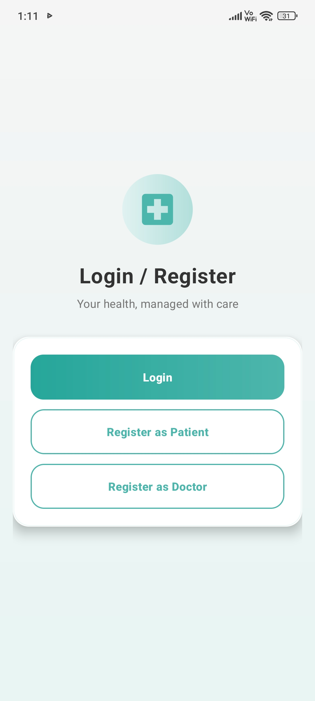
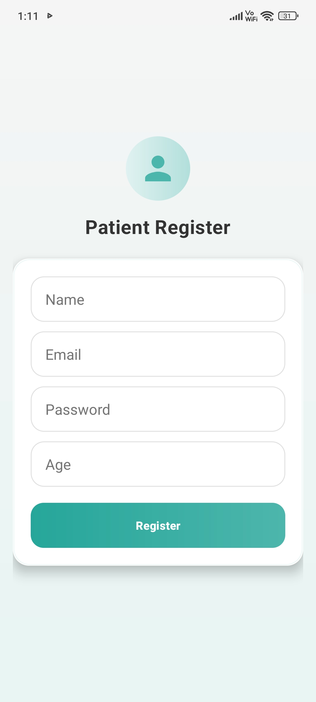
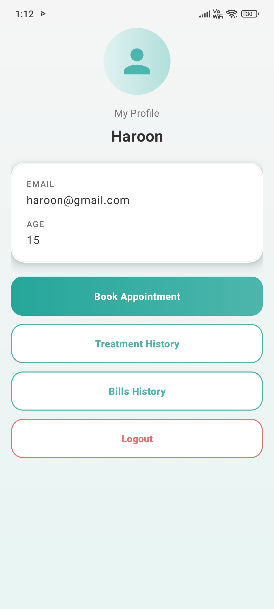
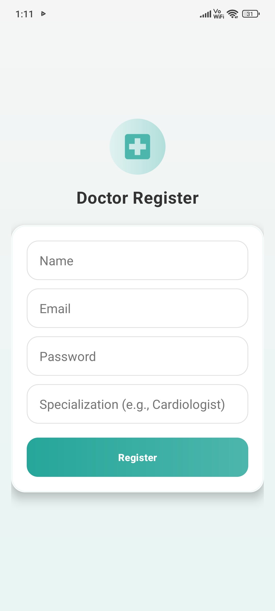
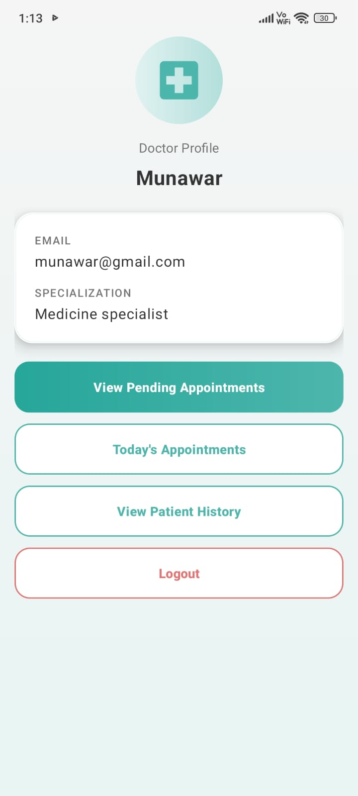
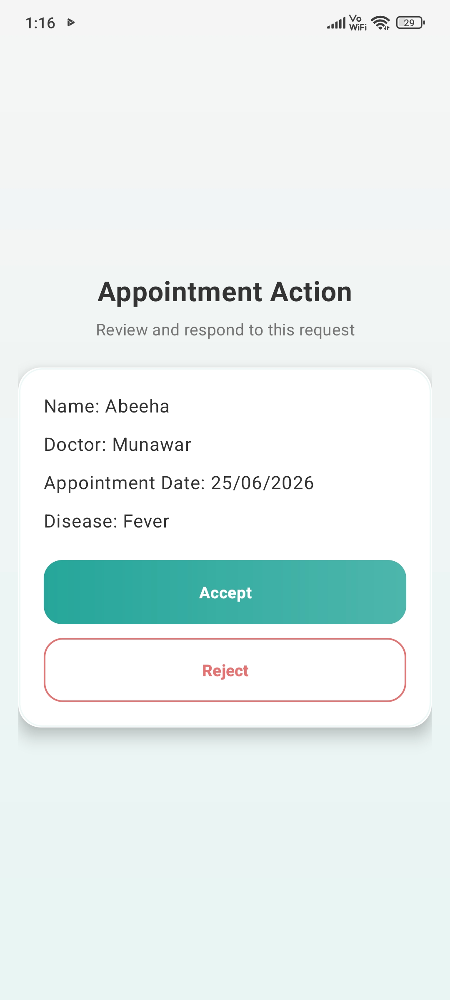
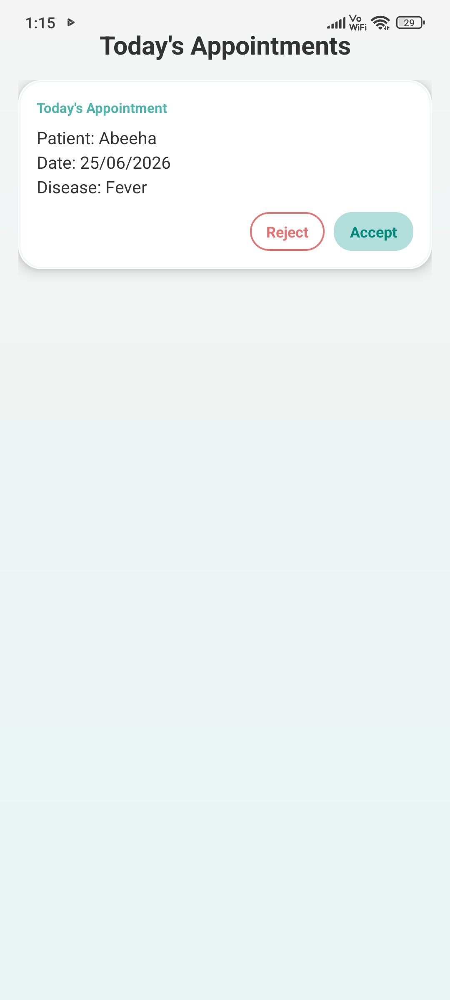
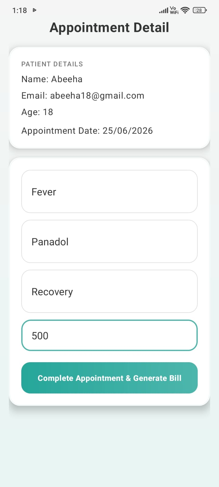

<div align="center">

# 🏥 MedSync - Medical Management System


</div>

---

## 📖 Overview

**MedSync** is a native Android healthcare management application built around a **dual-role architecture** — giving **Patients** and **Doctors** tailored portals within a single app. Patients can register, book appointments, and review their treatment and billing history; doctors can manage schedules, update clinical records, and generate medical bills — all synchronized in real time via **Firebase**.

Developed and submitted as an academic project for **Mobile App Development** at the **University of Agriculture, Faisalabad**, MedSync demonstrates production-grade patterns including role-based authentication, cloud-backed data persistence, and Material Design UI.

---

## 🧭 High-Level App Flow

```
Launch
│
└── Role Selection
    │
    ├── 👤 PATIENT
    │   ├── Login / Register
    │   └── Patient Dashboard
    │       ├── 📅 Book Appointments
    │       └── 📚 View History
    │           ├── 💊 Treatment History
    │           └── 🧾 Bills History
    │
    └── 🩺 DOCTOR
        ├── Login / Register
        └── Doctor Dashboard
            ├── ⏳ Manage Pending Requests
            └── 📝 Treatment & Billing
                ├── ✅ Accept / Reject Today's Appointments
                ├── 🩺 Clinical Records (Diagnosis / Prescription / Progress)
                └── 💰 Automated Billing
```

---

## 📸 Visual Showcase

### Patient Experience

| Role Selection | Patient Registration | Patient Dashboard |
|:---:|:---:|:---:|
|  |  |  |

### Doctor Workflow

| Doctor Registration | Doctor Dashboard | Appointment Action |
|:---:|:---:|:---:|
|  |  |  |

### Treatment & Records

| Today's Appointments | Treatment & Billing | |
|:---:|:---:|:---:|
|  |  | |

---

## ✨ Core Features

### 👤 For Patients

- 🔐 **Registration** — Secure email/password sign-up via Firebase Authentication
- 🏠 **Dashboard** — Profile overview with quick navigation to all patient features
- 📅 **Book Appointments** — Schedule visits with doctor name, date/time picker, and problem description
- 🧾 **Bills History** — Review itemized medical bills from completed appointments
- 💊 **Treatment History** — Access diagnosis, prescription, and progress records in one place

### 🩺 For Doctors

- 🏠 **Dashboard** — Central hub with profile, specialization, and navigation shortcuts
- ⏳ **Manage Pending Appointments** — Review incoming patient booking requests in real time
- ✅ **Accept / Reject Today's Appointments** — Approve or decline scheduled visits with one tap
- 🩺 **Clinical Records** — Record diagnosis, prescription, and treatment progress per visit
- 💰 **Automated Billing** — Generate itemized bills with consultation and medicine fees

### 🔐 Security Features

- 🔑 **Firebase Authentication** — Industry-standard email/password auth with secure session management
- 🎭 **Role-Based Routing** — Post-login navigation driven by user role (`patient` or `doctor`)

---

## 👥 User Roles

| Role | Access | Key Features |
|------|--------|--------------|
| 👤 **Patient** | Patient Home, Booking, History screens | Register & login · View profile · Book appointments · Treatment history · Bills history |
| 🩺 **Doctor** | Doctor Dashboard, Appointment management, Clinical tools | Register & login · Pending appointments · Accept/reject visits · Update treatment · Generate bills · Patient history |

---

## 🛠️ Technology Stack

**Frontend**
- XML layouts · Material Design Components · CardView · RecyclerView · ConstraintLayout

**Backend**
- Firebase Authentication (Email/Password)

**Database**
- Firebase Realtime Database with live data listeners

**Tools**
- Android Studio · Gradle · Google Services Plugin · Java 11

---

## 🚀 Quick Start

**1. Clone the repository**

```bash
git clone https://github.com/YOUR_USERNAME/MedicalManagementSystem.git
cd MedicalManagementSystem
```

**2. Configure Firebase**

1. Create a project at the [Firebase Console](https://console.firebase.google.com/)
2. Enable **Email/Password** sign-in under Authentication
3. Create a **Realtime Database** and apply security rules
4. Register an Android app with package name `com.medical.app`
5. Download `google-services.json` and place it in the **`app/`** directory

**3. Build & Run**

```bash
./gradlew assembleDebug
```

Open the project in **Android Studio**, connect a device or launch an emulator, and click **Run ▶**.

> ⚠️ **Important:** Ensure you place your `google-services.json` file inside the `app/` directory before building the project in Android Studio.

---

## 🎯 Learning Outcomes

Through building **MedSync**, the following core mobile development competencies were demonstrated:

- 🔥 **Firebase Integration** — End-to-end setup of Authentication and Realtime Database with live data listeners
- 📋 **RecyclerView & CardView** — Dynamic list rendering for appointments, history, and billing screens
- 🎭 **Role-Based Authentication** — Dual-portal routing based on user role stored in the cloud
- 🎨 **Material Design UI** — Consistent theming, input fields, buttons, and card-based layouts in XML
- ☁️ **Real-Time Data Sync** — CRUD operations with Firebase listeners for instant UI updates across roles

---

## 🔮 Future Enhancements

- 📄 **PDF Bill Generation** — Export and share itemized medical bills as downloadable PDF documents
- 🔔 **Push Notifications** — Appointment reminders, accept/reject alerts, and bill confirmations via FCM
- 📹 **Video Consultations** — In-app telemedicine sessions between patients and doctors
- 💬 **In-App Messaging** — Secure chat channel for pre- and post-appointment communication

---

<div align="center">

**MedSync** · University of Agriculture, Faisalabad · Mobile App Development

<br/>

`com.medical.app` · Android · Java · Firebase

</div>
